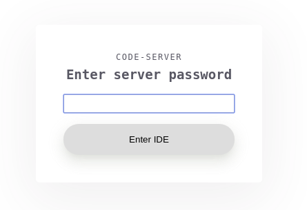
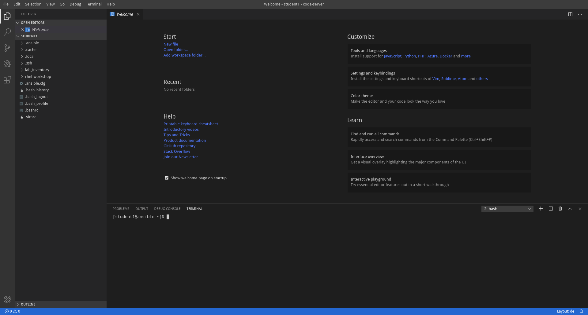

# Exercise 2 - Inventories, credentials and ad hoc commands

**Read this in other languages**:  [English](README.md),   [日本語](README.ja.md).

## Create an Inventory

Let’s get started with: The first thing we need is an inventory of your managed hosts. This is the equivalent of an inventory file in Ansible Engine. There is a lot more to it (like dynamic inventories) but let’s start with the basics.

  - You should already have the web UI open, if not: Point your browser to the URL you were given, similar to **`https://student<X>.<workshopname>.rhdemo.io`** (replace "\<X\>" with your student number and "\<workshopname\>" with the name of your current workshop) and log in as `admin`. The password will be provided by the instructor.

Create the inventory:

  - In the web UI menu on the left side, go to **RESOURCES** → **Inventories**, click the  button on the right side and choose **Inventory**.

  - **NAME:** Workshop Inventory

  - **ORGANIZATION:** Default

  - Click **SAVE**

Now there will be two inventories, the **Demo Inventory** and the **Workshop Inventory**. In the **Workshop Inventory** click the **Hosts** button, it will be empty since we have not added any hosts there.

So let's add some hosts. First we need to have the list of all hosts which are accessible to you within this lab. These can be found in an inventory on the ansible control node on which Tower is installed.

Login to your Tower control host via code-server:

You have been provided access to a virtual terminal/shell via code-server, an open-source Visual Studio code editor:

    https://student<X>-code.<workshop>.rhdemo.io

Use the above link in your browser by replacing **\<X\>** in student**\<X\>** by the student number and **\<workshop\>** by the workshop name provided to you.



Use the provided password to login into the code-server and open a new terminal by heading to the menu item "Terminal" at the top of the page and select "New Terminal". A new section will appear in the lower half of the screen and you will be presented a prompt:




You can find the inventory information at `~/lab_inventory/hosts`. Output them with `cat`, they should look like:

```bash
$ cat ~/lab_inventory/hosts
[all:vars]
ansible_user=student<X>
ansible_ssh_pass=<PASSWORD>
ansible_port=22

[web]
node1 ansible_host=22.33.44.55
node2 ansible_host=33.44.55.66
node3 ansible_host=44.55.66.77

[control]
ansible ansible_host=11.22.33.44
```
> **Warning**
>
> In your inventory the IP addresses will be different.

Note the names for the nodes and the IP addresses, we will use them to fill the inventory in Tower now:

  - In the inventory view of Tower click on your **Workshop Inventory**

  - Click on  the **HOSTS** button

  - To the right click the  button.

  - **HOST NAME:** `node1`

  - **Variables:** Under the three dashes `---`, enter `ansible_host: 22.33.44.55` in a new line. Make sure to enter your specific IP address for your `node1` from the inventory looked up above, and note that the variable definition has a colon **:** and a space between the values, not an equal sign **=** like in the inventory file.

  - Click **SAVE**

  - Go back to **HOSTS** and repeat to add `node2` as a second host and `node3` as a third node. Make sure that for each node you enter the right IP addresses.

You have now created an inventory with three managed hosts.

## Machine Credentials

One of the great features of Ansible Tower is to make credentials usable to users without making them visible. To allow Tower to execute jobs on remote hosts, you must configure connection credentials.

> **Note**
>
> This is one of the most important features of Tower: **Credential Separation**\! Credentials are defined separately and not with the hosts or inventory settings.

As this is an important part of your Tower setup, why not make sure that connecting to the managed nodes from Tower is working?

To access the nodes via SSH do the following:

- Login to your Tower control host via code-server:

    https://student<X>-code.<workshop>.rhdemo.io

Use the above link in your browser by replacing **\<X\>** in student**\<X\>** by the student number and **\<workshop\>** by the workshop name provided to you.

- From Tower SSH into `node1` or one of the other nodes (look up the IP addresses from the inventory) and execute `sudo -i`.
- For the SSH connection use the node password from the inventory file, `sudo -i` works without password.

```bash
[student<X>@ansible ~]$ ssh student<X>@22.33.44.55
student<X>@22.33.44.55's password:
Last login: Thu Jul  4 14:47:04 2019 from 11.22.33.44
[student<X>@node1 ~]$ sudo -i
[root@node1 ~]#
```

What does this mean?

  - Tower user **student<X>** can connect to the managed hosts with password based SSH

  - User **student<X>** can execute commands on the managed hosts as **root** with `sudo`

## Configure Machine Credentials

Now we will configure the credentials to access our managed hosts from Tower. In the **RESOURCES** menu choose **Credentials**. Now:

Click the  button to add new credentials

  - **NAME:** Workshop Credentials

  - **ORGANIZATION:** Default

  - **CREDENTIAL TYPE:** Click on the magnifying glass, pick **Machine** and click 

  - **USERNAME:** student<X> - make sure to replace the **<X>** with your actual student number!

  - **PASSWORD:** Enter the password from the inventory file.

  - **PRIVILEGE ESCALATION METHOD:** sudo

  - Click **SAVE**

  - Go back to the **RESOURCES** → **Credentials** → **Workshop Credentials** and note that the password is not visible.

> **Tip**
>
> Whenever you see a magnifiying glass icon next to an input field, clicking it will open a list to choose from.

You have now setup credentials to use later for your inventory hosts.

## Run Ad Hoc Commands

As you’ve probably done with Ansible before you can run ad hoc commands from Tower as well.

  - In the web UI go to **RESOURCES → Inventories → Workshop Inventory**

  - Click the **HOSTS** button to change into the hosts view and select the three hosts by ticking the boxes to the left of the host entries.

  - Click **RUN COMMANDS**. In the next screen you have to specify the ad hoc command:

      - As **MODULE** choose **ping**

      - For **MACHINE CREDENTIAL** click the magnifying glass icon and select **Workshop Credentials**.

      - Click **LAUNCH**, and watch the output.

The simple **ping** module doesn’t need options. For other modules you need to supply the command to run as an argument. Try the **command** module to find the userid of the executing user using an ad hoc command.

- **MODULE:** command

- **ARGUMENTS:** id

> **Tip**
>
> After choosing the module to run, Tower will provide a link to the docs page for the module when clicking the question mark next to "Arguments". This is handy, give it a try.

How about trying to get some secret information from the system? Try to print out */etc/shadow*.

- **MODULE:** command

- **ARGUMENTS:** cat /etc/shadow

> **Warning**
>
> **Expect an error\!**

Oops, the last one didn’t went well, all red.

Re-run the last ad hoc command but this time tick the **ENABLE PRIVILEGE ESCALATION** box.

As you see, this time it worked. For tasks that have to run as root you need to escalate the privileges. This is the same as the **become: yes** you’ve probably used often in your Ansible Playbooks.

## Challenge Lab: Ad Hoc Commands

Okay, a small challenge: Run an ad hoc to make sure the package "tmux" is installed on all hosts. If unsure, consult the documentation either via the web UI as shown above or by running `[ansible@tower ~]$ ansible-doc yum` on your Tower control host.

> **Warning**
>
> <details><summary>Solution below!</summary>
> <p>
> - **MODULE:** yum
>
> - **ARGUMENTS:** name=tmux
>
> - Tick **ENABLE PRIVILEGE ESCALATION**
> </p>
> </details>

> **Tip**
>
> The yellow output of the command indicates Ansible has actually done something (here it needed to install the package). If you run the ad hoc command a second time, the output will be green and inform you that the package was already installed. So yellow in Ansible doesn’t mean "be careful"…​ ;-).

----

[Click here to return to the Ansible for Red Hat Enterprise Linux Workshop](../README.md#section-2---ansible-tower-exercises)
